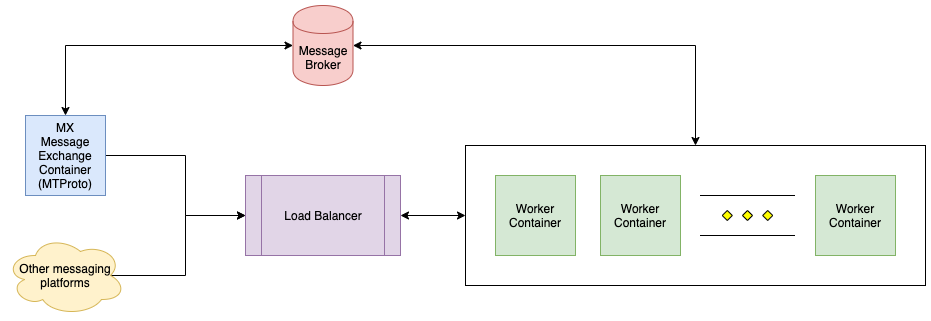

# Quaranteams Bot

## Goals

- Bypass the rate limit imposed by Telegram Bot API
- Decouple message handlers from messaging platform specific library
- Enable load balancing
- Improve  horizontal scalability and elasticity
- No over-provisioning of hardware resources
- Stateless worker
- Deployment without downtime
- Serverless 🙌🏻

## Generic Architecture



The cloud provider of choice is AWS, infrastructure is deployed using AWS Cloud Development Kit (CDK), refer [here](https://docs.aws.amazon.com/cdk/latest/guide/getting_started.html) for getting started.

```
# deploy
pip install -r requirements.txt
cdk synth
cdk deploy

# clean up
cdk destroy
```

## Monolithic Fallback


This deployment mode can be used when we are serving a small user group only and neither load balancing nor horizontal scaling are crucial, developers are expected to use this during development of the MX and Worker containers.

Create a `.env` file from `.env.example` and fill in with your own set of Telegram bot's credentials.

Feel free to modify the Dockerfile and docker-compose.yml files in the development branch to suit your own preferences, i.e. you might want to use [bind mounts](https://docs.docker.com/storage/bind-mounts/) to reference your codes on host machine directly from Docker container. Refer [here](https://docs.docker.com/compose/compose-file/#volumes) for more information.

```
# start up
docker-compose up

# stop and clean up
docker-compose down

# run this when your container has been updated
docker-compose build
```

Refer [here](https://docs.docker.com/compose/reference/) for a list of docker-compose commands.
