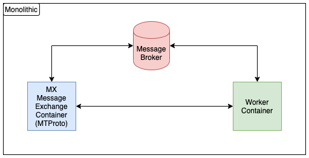

# Submissions

#### [Link to the demonstration video](https://www.youtube.com/watch?v=gR71QjbmJvo)
#### [Link to the presentation slides](https://docs.google.com/presentation/d/1YxOG8uyPY6fy_Q7czGD5bJGpYhFRngDTRjdESdkzCLI/edit?usp=sharing)
#### [Link to the user manual](https://docs.google.com/document/d/1yM8Fy_c3kIlEPvMYso4nH1ZZVMo2aN-5uhWAhb0Vegk/edit?usp=sharing)
#### [Link to the demonstration video](https://quaranteams-admin.herokuapp.com/#/login)
#### [Link to the Psychologist / Staff / Admin Login Page](https://quaranteams-admin.herokuapp.com/#/login)
#### [Link to The Users(Client) Login Page](https://quaranteams-main.herokuapp.com/login)
#### [Link to our humanized chat bot](https://t.me/Quaranteams_bot)
#### [Link to the DASS-21 Original Question Sets](https://journals.plos.org/plosone/article/file?type=supplementary&id=info:doi/10.1371/journal.pone.0219193.s004#:~:text=The%20Depression%2C%20Anxiety%20and%20Stress,into%20subscales%20with%20similar%20content.)
#### [Link to the IES-R Original Question Sets](https://www.aerztenetz-grafschaft.de/download/IES-R-englisch-5-stufig.pdf)
#### [Link to the Backend Main Service](https://github.com/cosmos-ummc/comet)
#### [Link to the Client Website repository](https://github.com/cosmos-ummc/mayall)
#### [Link to the Admin Dashboard repository](https://github.com/cosmos-ummc/butterfly)
#### [Link to the Backend Chat Service repository](https://github.com/cosmos-ummc/needle)
#### [Link to the Telegram Chat Bot repository](https://github.com/cosmos-ummc/Willman)

# Quaranteams Bot

## Goals

- Bypass the rate limit imposed by Telegram Bot API
- Decouple message handlers from messaging platform specific library
- Enable load balancing
- Improve  horizontal scalability and elasticity
- No over-provisioning of hardware resources
- Stateless worker
- Deployment without downtime
- Serverless 🙌🏻

## Generic Architecture


The cloud provider of choice is AWS, infrastructure is deployed using AWS Cloud Development Kit (CDK), refer [here](https://docs.aws.amazon.com/cdk/latest/guide/getting_started.html) for getting started.

```
# deploy
pip install -r requirements.txt
cdk synth
cdk deploy

# clean up
cdk destroy
```

## Monolithic Fallback



This deployment mode can be used when we are serving a small user group only and neither load balancing nor horizontal scaling are crucial, developers are expected to use this during development of the MX and Worker containers.

Create a `.env` file from `.env.example` and fill in with your own set of Telegram bot's credentials.

Feel free to modify the Dockerfile and docker-compose.yml files in the development branch to suit your own preferences, i.e. you might want to use [bind mounts](https://docs.docker.com/storage/bind-mounts/) to reference your codes on host machine directly from Docker container. Refer [here](https://docs.docker.com/compose/compose-file/#volumes) for more information.

```
# start up
docker-compose up

# stop and clean up
docker-compose down

# run this when your container has been updated
docker-compose build
```

Refer [here](https://docs.docker.com/compose/reference/) for a list of docker-compose commands.
